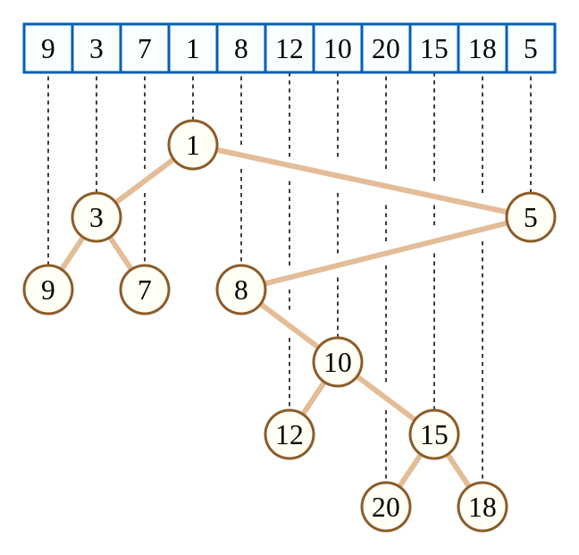

## 笛卡尔树
> 抄自oiwiki

笛卡尔树是一种二叉树，每一个节点由一个键值二元组 $(k,w)$ 构成。要求 $k$ 满足二叉搜索树的性质，而 $w$ 满足堆的性质。如果笛卡尔树的 $k,w$ 键值确定，且 $k$ 互不相同，$w$ 也互不相同，那么这棵笛卡尔树的结构是唯一的。如下图


```cpp
for (int i = 1; i <= n; i++)
{
    int k = top;  // top 表示操作前的栈顶，k 表示当前栈顶
    while (k > 0 && w[stk[k]] > w[i]) k--;  // 维护右链上的节点
    if (k) rs[stk[k]] = i;  // 栈顶元素.右儿子 := 当前元素
    if (k < top) ls[i] = stk[k + 1];  // 当前元素.左儿子 := 上一个被弹出的元素
    stk[++k] = i;                     // 当前元素入栈
    top = k;
}
```
### 应用
#### 节点关系传递
[24ICPC杭州M](https://codeforces.com/gym/105657/problem/M)
这题其实不需要笛卡尔树，只需要栈关系即可。

若是 $x \rightarrow y, y \rightarrow z$，则可以把关系传递 $x \rightarrow z$